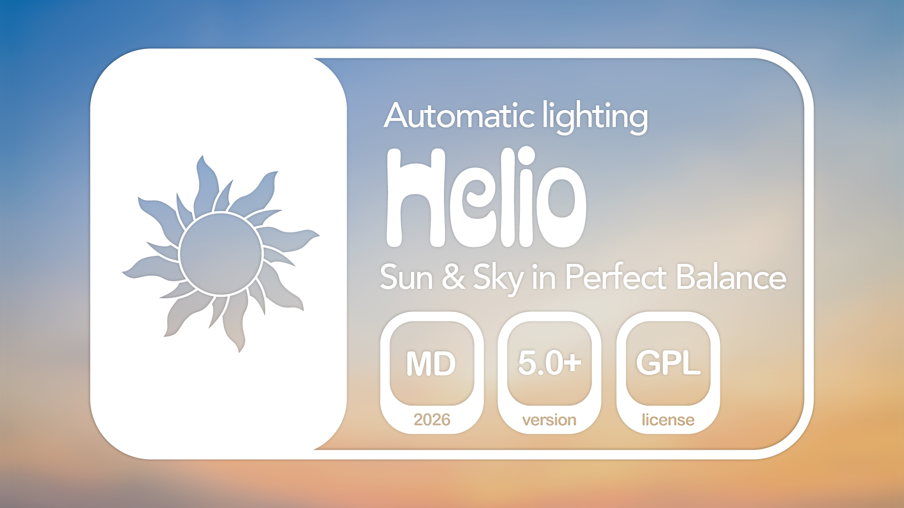
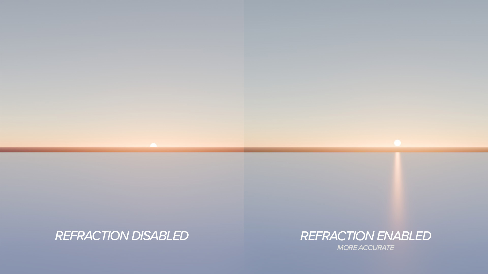
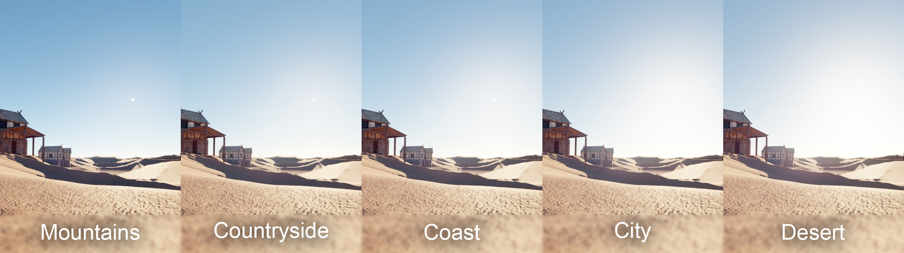
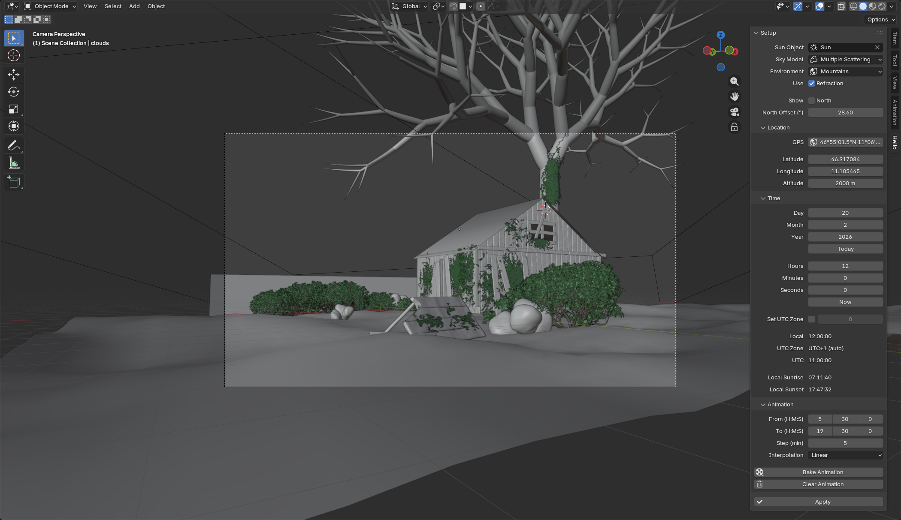

# Helio – Automatic Sun & Sky Lighting

Helio is a Blender add-on for automatic lighting of 3D scenes based on
real-world GPS coordinates, date, and time. It calculates the Sun's position
using the NOAA Solar Calculator algorithm and applies the result to the
Sky Texture and Sun light object, including color temperature and intensity.

Designed for architectural visualization, exterior rendering, and any
scene where physically accurate sunlight is required.

---

## 👀 Features

- Sun position calculated from GPS coordinates, date, and time (NOAA algorithm)
- Automatic color temperature (CCT) based on solar elevation
- Automatic sun intensity based on Kasten's Air Mass formula with altitude correction
- Atmospheric refraction correction for accurate sunrise and sunset
- Sky Texture setup with Multiple Scattering or Single Scattering model
- Five environment presets affecting atmospheric parameters
- North offset indicator with viewport overlay
- Automatic UTC offset detection from GPS coordinates (with manual override)
- Animation baking with configurable time range, step, and interpolation

---

## ❗ Requirements

- Blender 5.0 or newer
- No internet connection required

---

## 📥 Installation

1. Download the latest `helio-x.x.x.zip` from [Releases](../../releases).
2. In Blender open *Edit → Preferences → Extensions → ▼ → Install from Disk*.
3. Select the downloaded `.zip` file.
4. Enable the add-on by checking **Helio** in the list.

---

## 🤖 Usage

1. Add a **Sun** light to your scene.
2. Open the **N-panel** in the 3D Viewport and navigate to the **Helio** tab.
3. Select your Sun light object in the **Sun Object** field.
4. Set your location, date, and time.
5. Click **Apply**.

---

## 🧊 Examples

### Residential building (full day)

### Mountain cabin (full day)

---

## Atmospheric refraction

Refraction correction shifts the apparent solar position near the horizon,
affecting the accuracy of sunrise and sunset calculations.

---

## 🏞️ Environment presets

Each preset adjusts air density, aerosol density, and ozone density
of the Sky Texture to approximate different atmospheric conditions.

| Preset | Air Density | Aerosol Density | Ozone Density |
|---|---|---|---|
| City | 1.0 | 1.0 | 1.0 |
| Countryside | 1.0 | 0.3 | 1.0 |
| Mountains | 0.7 | 0.1 | 0.8 |
| Desert | 1.0 | 1.5 | 0.8 |
| Coast | 1.0 | 0.5 | 1.1 |

These values are empirical approximations based on qualitative differences
in atmospheric composition. Only the City preset corresponds to Blender's
default Sky Texture values. Other presets are visual approximations
without claim to physical accuracy.

---

## ☀️ Panel Reference

### ⚙️ Main

| Field | Description | Range |
|---|---|---|
| Sun Object | Sun light object to control | Any Sun light |
| Sky Model | Sky Texture shading model | Multiple Scattering / Single Scattering |
| Environment | Atmospheric preset | City / Countryside / Mountains / Desert / Coast |
| Use Refraction | Atmospheric refraction correction | On / Off |
| Show North | North direction overlay in viewport | On / Off |
| North Offset | Rotation of scene north from true north | -360° to 360° |

### 📍 Location

| Field | Description | Range |
|---|---|---|
| GPS | Paste GPS coordinates (decimal or DMS format) | e.g. `50.087500, 14.421111` or `50°05'15.0"N 14°25'16.0"E` |
| Latitude | Geographic latitude | -90° to 90° |
| Longitude | Geographic longitude | -180° to 180° |
| Altitude | Elevation above sea level | 0 m and above |

### 🕐 Time

| Field | Description | Range |
|---|---|---|
| Day / Month / Year | Date | 1901–2099 |
| Hours / Minutes / Seconds | Local time | 00:00:00–23:59:59 |
| Today | Sets the current date | — |
| Now | Sets the current time | — |
| Set UTC Zone | Manual UTC offset override | On / Off |
| UTC Zone | Manual UTC offset value (active only if override is on) | -12 to +14 |
| Local Sunrise / Sunset | Calculated sunrise and sunset for the set date and location (shown after Apply) | — |

### 🎞️ Animation

| Field | Description | Range |
|---|---|---|
| From (H:M:S) | Start time of the baked animation | 00:00:00–23:59:59 |
| To (H:M:S) | End time of the baked animation | 00:00:00–23:59:59 |
| Step (min) | Interval between keyframes in minutes | 1–1439 |
| Interpolation | Keyframe interpolation type | Linear / Constant / Bezier |
| Bake Animation | Bakes sun position and sky parameters as keyframes for the set time range | — |
| Clear Animation | Removes all keyframes baked by Helio from the Sun object and World | — |

### ✅ Apply

| Button | Description |
|---|---|
| Apply | Calculates sun position and applies it to the scene for the current date and time |

---

## Notes 📝

- UTC offset is detected automatically from GPS coordinates using
  `timezonefinderL`, including daylight saving time. Manual override
  is available if automatic detection fails.
- Sun intensity is expressed in W/m² and corresponds to direct solar
  radiation at the given elevation and altitude.
- The north indicator overlay is drawn in the 3D Viewport as a green
  line indicating the direction of true north relative to the scene.

---

## License

[GPL-3.0-or-later](LICENSE)